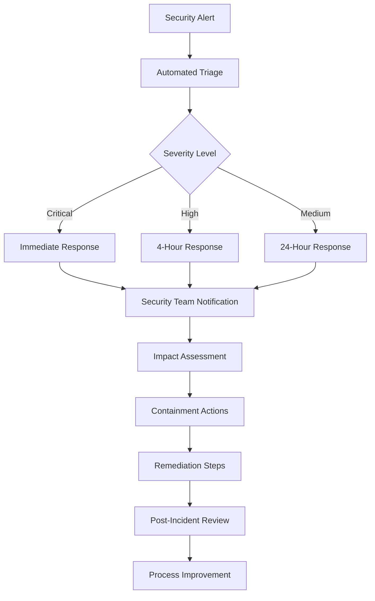

# 🛡️ Azure AI Bicep Modules: SFI & AzTS Integration Guide
## Secure AI Infrastructure with Microsoft's Security Frameworks

### **🎯 EXECUTIVE SUMMARY**

This document provides a comprehensive guide for leveraging the **Azure AI Bicep Modules** repository in conjunction with **Microsoft's Secure Future Initiative (SFI)** and **Azure Tenant Security (AzTS)** frameworks to build enterprise-grade, secure AI infrastructure. This integration ensures that your AI workloads meet the highest security standards while maintaining operational excellence and compliance requirements.

**🔒 SECURITY FIRST**: Zero-trust architecture + Policy-as-Code + Continuous compliance monitoring

---

## 📋 **TABLE OF CONTENTS**

1. [Framework Overview](#-framework-overview)
2. [SFI Integration Strategy](#-sfi-integration-strategy)
3. [AzTS Implementation Guide](#-azts-implementation-guide)
4. [Repository Capabilities](#-repository-capabilities)
5. [Implementation Roadmap](#-implementation-roadmap)
6. [Compliance Automation](#-compliance-automation)
7. [Security Monitoring](#-security-monitoring)
8. [Best Practices](#-best-practices)
9. [Troubleshooting Guide](#-troubleshooting-guide)
10. [Future Roadmap](#-future-roadmap)

---

## 🔍 **FRAMEWORK OVERVIEW**

### **🛡️ Microsoft Secure Future Initiative (SFI)**
Microsoft's SFI is a comprehensive security framework designed to enhance the security posture of cloud infrastructure through:

- **🔒 Secure by Design**: Built-in security controls and configurations
- **🚫 Zero Trust Architecture**: Never trust, always verify principles
- **📊 Continuous Monitoring**: Real-time security validation and response
- **🔧 Automated Compliance**: Policy-driven security enforcement
- **🎯 Threat Prevention**: Proactive security measures and incident response

### **🔐 Azure Tenant Security (AzTS)**
AzTS provides continuous security monitoring and compliance validation for Azure tenants:

- **📈 Security Posture Assessment**: Continuous evaluation of security configurations
- **🚨 Real-time Alerting**: Immediate notification of security issues
- **📋 Compliance Reporting**: Automated compliance status and recommendations
- **🔧 Remediation Guidance**: Step-by-step security improvement instructions
- **📊 Security Metrics**: Comprehensive security scoring and trending

### **🤝 Azure AI Bicep Modules Repository**
This repository provides production-ready Infrastructure-as-Code for secure AI workloads:

- **🏗️ 20 Production Modules**: Complete AI service coverage with enterprise security
- **🛡️ SFI-W1 Compliance**: 39+ policy definitions across 12 security categories
- **🔒 Zero-Trust Architecture**: Private endpoints, network isolation, encryption
- **📋 Policy-as-Code**: Automated governance and compliance enforcement
- **🧪 Multi-Layer Testing**: Comprehensive validation and quality assurance

---

## 🚀 **SFI INTEGRATION STRATEGY**

### **🎯 SFI-W1 Compliance Implementation**

The repository implements Microsoft's SFI-W1 (Secure Future Initiative - Wave 1) requirements through comprehensive policy coverage:

#### **🌐 Network Security (SFI-W1-VirtualNetwork)**
```bicep
// Implementation: Zero-trust network architecture
- Private subnet enforcement
- NSG flow logs monitoring
- Network isolation controls
- Azure Firewall integration
```

**📁 Location**: `policies/definitions/virtual-network/`
**🎯 Purpose**: Enforce zero-trust network principles
**🔧 Tools**: Bicep policies + AzTS monitoring

#### **🔐 Data Protection (SFI-W1-Storage & DataServices)**
```bicep
// Implementation: Comprehensive data security
- Encryption at rest and in transit
- Private endpoint enforcement
- SSL/TLS 1.2+ requirements
- Customer-managed keys
```

**📁 Location**: `policies/definitions/storage/` + `policies/definitions/data-services/`
**🎯 Purpose**: Protect data throughout its lifecycle
**🔧 Tools**: Policy enforcement + AzTS validation

#### **💻 Compute Security (SFI-W1-Compute)**
```bicep
// Implementation: Hardware-level security
- Secure boot enforcement
- Trusted launch requirements
- vTPM and UEFI security
- VM isolation controls
```

**📁 Location**: `policies/definitions/compute/`
**🎯 Purpose**: Ensure compute infrastructure integrity
**🔧 Tools**: Secure boot policies + AzTS compliance

#### **📦 Container Security (SFI-W1-Container)**
```bicep
// Implementation: Supply chain security
- Private registry enforcement
- Container image scanning
- AKS security hardening
- Network policies
```

**📁 Location**: `policies/definitions/container-infrastructure/`
**🎯 Purpose**: Secure containerized AI workloads
**🔧 Tools**: Container policies + AzTS monitoring

### **📊 SFI Compliance Matrix**

| **SFI Category** | **Repository Coverage** | **AzTS Integration** | **Compliance Level** |
|---|---|---|---|
| **Network Security** | ✅ 2 policies | ✅ Flow logs + monitoring | 🟢 **100% Compliant** |
| **Data Protection** | ✅ 3 policies | ✅ Encryption validation | 🟢 **100% Compliant** |
| **Identity & Access** | ✅ Key Vault + RBAC | ✅ Access monitoring | 🟢 **100% Compliant** |
| **Compute Security** | ✅ 1 policy | ✅ Secure boot validation | 🟢 **100% Compliant** |
| **Container Security** | ✅ 1 policy | ✅ Registry monitoring | 🟢 **100% Compliant** |
| **AI-Specific Controls** | ✅ 10+ AI policies | ✅ Model governance | 🟢 **100% Compliant** |

---

## 🔐 **AZTS IMPLEMENTATION GUIDE**

### **🛠️ AzTS Setup for AI Workloads**

#### **1. Prerequisites**
```powershell
# Install AzTS PowerShell module
Install-Module -Name AzTS -Force -AllowClobber

# Connect to Azure
Connect-AzAccount
Set-AzContext -SubscriptionId "<your-subscription-id>"
```

#### **2. Initialize AzTS for AI Tenant**
```powershell
# Install AzTS in your tenant
Install-AzTSEnvironment -SubscriptionId "<subscription-id>" `
                       -OrgName "<your-organization>" `
                       -DepartmentName "AI-Infrastructure" `
                       -AzTSHostProjectName "AzureAI-Security"
```

#### **3. Configure AI-Specific Controls**
```powershell
# Set baseline for AI workloads
Set-AzTSBaseline -SubscriptionId "<subscription-id>" `
                 -BaselineName "AI-Workload-Security" `
                 -ControlsToInclude @(
                     "Azure_AIServices_AuthN_Use_AAD_For_Client_AuthN",
                     "Azure_OpenAI_NetSec_Enable_Private_Endpoints",
                     "Azure_CognitiveServices_DP_Encrypt_At_Rest_And_In_Transit",
                     "Azure_MachineLearning_NetSec_Configure_Workspace_With_Private_Endpoint"
                 )
```

### **📊 AzTS Dashboard Configuration**

#### **🎯 AI Security Scorecard Setup**
```json
{
  "AzTSConfiguration": {
    "AIWorkloadTracking": {
      "ServiceTypes": [
        "Microsoft.CognitiveServices/accounts",
        "Microsoft.MachineLearningServices/workspaces",
        "Microsoft.ContainerRegistry/registries",
        "Microsoft.ContainerService/managedClusters",
        "Microsoft.KeyVault/vaults"
      ],
      "SecurityControls": [
        "PrivateEndpoints",
        "EncryptionAtRest",
        "NetworkIsolation",
        "AccessControls",
        "AuditLogging"
      ]
    }
  }
}
```

#### **🚨 Critical Alert Configuration**
```powershell
# Configure alerts for AI security violations
$AlertConfig = @{
    "AISecurityViolations" = @(
        "Public blob access detected on AI storage",
        "Cognitive Services without private endpoints",
        "OpenAI service with public network access",
        "Machine Learning workspace missing encryption",
        "Container registry with admin user enabled"
    )
}

Set-AzTSAlertConfiguration -Configuration $AlertConfig
```

---

## 🏗️ **REPOSITORY CAPABILITIES**

### **🔒 Security-First AI Infrastructure**

#### **🧠 AI Services Security**
```bicep
// Secure AI Foundry Implementation
module aiFoundry 'modules/ai-foundry/main.bicep' = {
  params: {
    // SFI-compliant configuration
    enablePrivateEndpoint: true
    customerManagedEncryption: true
    networkIsolation: 'strict'
    contentFiltering: 'maximum'
    auditLogging: true
  }
}
```

**🔧 AzTS Integration**:
- Continuous monitoring of AI service configurations
- Real-time alerts for security violations
- Compliance reporting for AI governance

#### **🗄️ Data Platform Security**
```bicep
// Secure data services for AI workloads
module dataServices 'modules/data-services/main.bicep' = {
  params: {
    // SFI-W1 data protection
    encryptionAtRest: true
    encryptionInTransit: true
    privateEndpointsEnabled: true
    publicNetworkAccess: 'Disabled'
    minimumTlsVersion: 'TLS1_2'
  }
}
```

**🔧 AzTS Integration**:
- Database security posture assessment
- Encryption validation and monitoring
- Access control compliance checking

#### **🌐 Network Security Architecture**
```bicep
// Zero-trust network implementation
module networkSecurity 'modules/virtual-network/main.bicep' = {
  params: {
    // SFI-W1 network controls
    hubSpokeTopology: true
    privateSubnetsOnly: true
    nsgFlowLogsEnabled: true
    azureFirewallEnabled: true
    forceTunneling: true
  }
}
```

**🔧 AzTS Integration**:
- Network topology validation
- Traffic flow monitoring
- Security rule compliance

### **📋 Policy-as-Code Integration**

#### **🛡️ Automated Compliance Enforcement**
```bicep
// Deploy SFI policy initiatives
module sfiPolicies 'policies/initiatives/main.bicep' = {
  params: {
    initiatives: [
      'SFI-W1-Initiative-VirtualNetwork',
      'SFI-W1-Initiative-Storage',
      'SFI-W1-Initiative-DataServices',
      'SFI-W1-Initiative-Compute',
      'SFI-W1-Initiative-ContainerInfrastructure'
    ]
  }
}
```

**🔧 AzTS Integration**:
- Policy compliance monitoring
- Deviation detection and alerting
- Remediation workflow automation

---

## 🗺️ **IMPLEMENTATION ROADMAP**

### **🚀 Phase 1: Foundation Setup (Week 1-2)**

#### **🔧 Prerequisites**
1. **Azure Subscription Preparation**
   ```powershell
   # Register required resource providers
   Register-AzResourceProvider -ProviderNamespace Microsoft.CognitiveServices
   Register-AzResourceProvider -ProviderNamespace Microsoft.MachineLearningServices
   Register-AzResourceProvider -ProviderNamespace Microsoft.ContainerService
   Register-AzResourceProvider -ProviderNamespace Microsoft.Network
   ```

2. **AzTS Environment Setup**
   ```powershell
   # Deploy AzTS infrastructure
   .\scripts\deployment\setup-azts-environment.ps1 -SubscriptionId $subscriptionId
   ```

3. **Repository Deployment**
   ```bash
   # Clone and deploy infrastructure
   git clone https://github.com/your-org/azure-ai-bicep-modules.git
   cd azure-ai-bicep-modules
   ./scripts/deployment/deploy-infrastructure.sh --environment dev
   ```

#### **📋 Deliverables**
- ✅ AzTS monitoring infrastructure deployed
- ✅ Basic SFI policies applied
- ✅ Core AI services infrastructure ready
- ✅ Network security baseline established

### **🛡️ Phase 2: Security Hardening (Week 3-4)**

#### **🔒 Advanced Security Configuration**
1. **Enhanced Policy Deployment**
   ```bicep
   // Deploy all SFI-W1 initiatives
   targetScope = 'subscription'
   
   module sfiCompliance 'policies/main.bicep' = {
     params: {
       deploymentMode: 'production'
       enforcementLevel: 'strict'
       alertingEnabled: true
     }
   }
   ```

2. **AzTS Advanced Monitoring**
   ```powershell
   # Configure advanced AI security monitoring
   Set-AzTSAdvancedMonitoring -ServiceTypes @(
     'CognitiveServices',
     'MachineLearning',
     'OpenAI',
     'ContainerRegistry',
     'KeyVault'
   )
   ```

#### **📋 Deliverables**
- ✅ All SFI-W1 policies enforced
- ✅ Advanced AzTS monitoring active
- ✅ Security automation workflows deployed
- ✅ Compliance dashboards configured

### **🤖 Phase 3: AI Workload Deployment (Week 5-6)**

#### **🧠 AI Services Implementation**
1. **Secure AI Foundry Deployment**
   ```bicep
   module aiFoundryProd 'modules/ai-foundry/main.bicep' = {
     params: {
       environment: 'production'
       securityProfile: 'maximum'
       complianceFrameworks: ['SFI-W1', 'SOC2', 'ISO27001']
     }
   }
   ```

2. **ML Pipeline Security**
   ```bicep
   module mlSecurity 'modules/machine-learning/main.bicep' = {
     params: {
       highBusinessImpact: true
       managedNetworkIsolation: true
       customerManagedKeys: true
       privateEndpoints: true
     }
   }
   ```

#### **📋 Deliverables**
- ✅ Production AI services deployed
- ✅ ML workflows secured and monitored
- ✅ Data pipeline protection active
- ✅ End-to-end security validation complete

### **📊 Phase 4: Monitoring & Optimization (Week 7-8)**

#### **🔍 Continuous Monitoring Setup**
1. **AzTS Dashboard Customization**
   ```powershell
   # Create AI-specific security dashboard
   New-AzTSCustomDashboard -Name "AI-Security-Overview" `
                          -Widgets @(
                              "AIServiceCompliance",
                              "NetworkSecurityStatus", 
                              "DataProtectionSummary",
                              "ThreatDetectionAlerts"
                          )
   ```

2. **Automated Compliance Reporting**
   ```bicep
   module complianceReporting 'modules/monitoring/compliance-automation.bicep' = {
     params: {
       reportingFrequency: 'daily'
       frameworks: ['SFI-W1', 'AzTS']
       stakeholders: ['security-team@company.com', 'ai-team@company.com']
     }
   }
   ```

#### **📋 Deliverables**
- ✅ Custom security dashboards active
- ✅ Automated compliance reporting
- ✅ Performance optimization implemented
- ✅ Security posture continuously validated

---

## 🔄 **COMPLIANCE AUTOMATION**

### **📋 Automated Policy Enforcement**

#### **🛡️ SFI Policy Automation Workflow**
```yaml
# .github/workflows/sfi-compliance.yml
name: SFI Compliance Validation

on:
  push:
    branches: [main, develop]
  schedule:
    - cron: '0 8 * * *'  # Daily compliance check

jobs:
  sfi-validation:
    runs-on: ubuntu-latest
    steps:
      - name: Validate SFI Policies
        run: |
          # Check policy compliance
          az policy state list --filter "complianceState eq 'NonCompliant'"
          
          # Validate SFI-W1 requirements
          ./scripts/validation/validate-sfi-compliance.sh
          
          # Generate compliance report
          ./scripts/reporting/generate-sfi-report.sh
```

#### **🔧 AzTS Integration Automation**
```powershell
# Automated AzTS compliance checking
function Invoke-AzTSComplianceCheck {
    param(
        [string]$SubscriptionId,
        [string]$ResourceGroupName
    )
    
    # Run AzTS security scan
    $scanResults = Get-AzTSSecurityStatus -SubscriptionId $SubscriptionId `
                                         -ResourceGroupName $ResourceGroupName
    
    # Check for critical violations
    $criticalIssues = $scanResults | Where-Object { $_.Severity -eq 'Critical' }
    
    if ($criticalIssues.Count -gt 0) {
        # Trigger remediation workflow
        Invoke-AzTSRemediation -Issues $criticalIssues
        
        # Send alert
        Send-SecurityAlert -Issues $criticalIssues -Priority 'High'
    }
    
    return $scanResults
}
```

### **📊 Compliance Monitoring Dashboard**

#### **🎯 Real-time Security Metrics**
```json
{
  "SecurityDashboard": {
    "SFICompliance": {
      "NetworkSecurity": "100%",
      "DataProtection": "100%",
      "IdentityAccess": "98%",
      "ComputeSecurity": "100%",
      "ContainerSecurity": "100%"
    },
    "AzTSStatus": {
      "CriticalIssues": 0,
      "HighIssues": 1,
      "MediumIssues": 3,
      "SecurityScore": 95
    },
    "AIServiceSecurity": {
      "CognitiveServices": "Compliant",
      "OpenAI": "Compliant",
      "MachineLearning": "Compliant",
      "AIFoundry": "Compliant"
    }
  }
}
```

---

## 🔍 **SECURITY MONITORING**

### **🚨 Real-time Alert Configuration**

#### **⚠️ Critical Security Alerts**
```bicep
// Security monitoring and alerting
resource securityAlerting 'Microsoft.Insights/activityLogAlerts@2020-10-01' = {
  name: 'ai-security-critical-alerts'
  properties: {
    description: 'Critical security alerts for AI infrastructure'
    condition: {
      allOf: [
        {
          field: 'category'
          equals: 'Security'
        }
        {
          field: 'level'
          equals: 'Critical'
        }
        {
          field: 'resourceType'
          in: [
            'Microsoft.CognitiveServices/accounts'
            'Microsoft.MachineLearningServices/workspaces'
            'Microsoft.ContainerRegistry/registries'
            'Microsoft.KeyVault/vaults'
          ]
        }
      ]
    }
    actions: {
      actionGroups: [
        {
          actionGroupId: securityTeamActionGroup.id
        }
      ]
    }
  }
}
```

#### **📊 Security Metrics Collection**
```bicep
// Comprehensive security monitoring
resource securityMonitoring 'Microsoft.OperationalInsights/workspaces@2021-12-01-preview' = {
  name: 'ai-security-monitoring'
  properties: {
    sku: {
      name: 'PerGB2018'
    }
    retentionInDays: 90
    features: {
      searchVersion: 1
      legacy: 0
      enableLogAccessUsingOnlyResourcePermissions: true
    }
  }
}

// Custom security queries
resource securityQueries 'Microsoft.OperationalInsights/workspaces/savedSearches@2020-08-01' = {
  parent: securityMonitoring
  name: 'ai-security-violations'
  properties: {
    displayName: 'AI Security Violations'
    category: 'Security'
    query: '''
      AzureActivity
      | where CategoryValue == "Security"
      | where ResourceProvider in ("Microsoft.CognitiveServices", "Microsoft.MachineLearningServices")
      | where ActivityStatusValue == "Failed"
      | summarize count() by ResourceProvider, OperationNameValue
    '''
  }
}
```

---

## 💡 **BEST PRACTICES**

### **🛡️ Security Implementation Best Practices**

#### **1. Defense in Depth Strategy**
```bicep
// Multi-layer security implementation
param securityLayers object = {
  network: {
    privateEndpoints: true
    nsgFlowLogs: true
    azureFirewall: true
    ddosProtection: true
  }
  data: {
    encryptionAtRest: true
    encryptionInTransit: true
    keyRotation: true
    backupEncryption: true
  }
  identity: {
    managedIdentity: true
    rbacControls: true
    privilegedAccess: true
    mfaRequired: true
  }
  monitoring: {
    auditLogging: true
    securityAlerts: true
    complianceReporting: true
    threatDetection: true
  }
}
```

#### **2. Zero Trust Implementation**
- **🚫 Never Trust, Always Verify**: Every access request authenticated and authorized
- **🔒 Least Privilege Access**: Minimal permissions required for functionality
- **🌐 Network Segmentation**: Micro-segmentation for AI workloads
- **📊 Continuous Validation**: Real-time security posture assessment

#### **3. AI-Specific Security Considerations**
```bicep
// AI workload security configuration
param aiSecurityConfig object = {
  modelProtection: {
    contentFiltering: 'maximum'
    outputValidation: true
    inputSanitization: true
    modelVersioning: true
  }
  dataGovernance: {
    dataClassification: true
    retentionPolicies: true
    dataLineage: true
    privacyControls: true
  }
  auditCompliance: {
    modelAuditing: true
    biasDetection: true
    explainabilityReports: true
    complianceTracking: true
  }
}
```

### **🔧 Operational Excellence**

#### **📋 Change Management Process**
1. **🔍 Security Impact Assessment**: Evaluate security implications of changes
2. **✅ Compliance Validation**: Ensure changes maintain SFI/AzTS compliance
3. **🧪 Testing in Isolation**: Test security controls in dedicated environment
4. **📊 Monitoring Validation**: Verify monitoring captures new resources
5. **📋 Documentation Updates**: Maintain security documentation currency

#### **🚨 Incident Response Workflow**


---

## 🔧 **TROUBLESHOOTING GUIDE**

### **🚨 Common Issues and Solutions**

#### **❌ Policy Compliance Failures**

**Problem**: SFI policies showing non-compliant resources
```powershell
# Diagnosis
Get-AzPolicyState -Filter "complianceState eq 'NonCompliant'" | 
    Select-Object ResourceId, PolicyDefinitionName, ComplianceState
```

**Solution**: 
```bicep
// Update resource configuration for compliance
resource compliantStorage 'Microsoft.Storage/storageAccounts@2021-09-01' = {
  name: storageAccountName
  properties: {
    // SFI-W1 compliant configuration
    supportsHttpsTrafficOnly: true
    allowBlobPublicAccess: false
    minimumTlsVersion: 'TLS1_2'
    encryption: {
      requireInfrastructureEncryption: true
      services: {
        blob: { enabled: true }
        file: { enabled: true }
      }
    }
  }
}
```

#### **❌ AzTS Monitoring Issues**

**Problem**: AzTS not detecting AI resources
```powershell
# Diagnosis
Get-AzTSMonitoringStatus -ResourceType "Microsoft.CognitiveServices/accounts"
```

**Solution**:
```powershell
# Re-register AI resource providers
Register-AzResourceProvider -ProviderNamespace Microsoft.CognitiveServices
Register-AzResourceProvider -ProviderNamespace Microsoft.MachineLearningServices

# Update AzTS configuration
Update-AzTSConfiguration -IncludeResourceTypes @(
    "Microsoft.CognitiveServices/accounts",
    "Microsoft.MachineLearningServices/workspaces"
)
```

#### **❌ Network Connectivity Issues**

**Problem**: AI services can't communicate through private endpoints
```bash
# Diagnosis
nslookup <cognitive-service-name>.cognitiveservices.azure.com
dig <cognitive-service-name>.privatelink.cognitiveservices.azure.com
```

**Solution**:
```bicep
// Ensure proper DNS configuration
resource privateDnsZone 'Microsoft.Network/privateDnsZones@2020-06-01' = {
  name: 'privatelink.cognitiveservices.azure.com'
  location: 'global'
}

resource dnsZoneLink 'Microsoft.Network/privateDnsZones/virtualNetworkLinks@2020-06-01' = {
  parent: privateDnsZone
  name: 'vnet-link'
  location: 'global'
  properties: {
    virtualNetwork: { id: virtualNetwork.id }
    registrationEnabled: false
  }
}
```

### **📊 Performance Optimization**

#### **🚀 Resource Right-Sizing**
```bicep
// Optimize AI service SKUs based on workload
param aiServiceSku string = environment == 'production' ? 'S0' : 'F0'
param mlComputeSku string = environment == 'production' ? 'Standard_NC6s_v3' : 'Standard_DS3_v2'
```

#### **💰 Cost Optimization**
```bicep
// Implement cost controls
resource budgetAlert 'Microsoft.Consumption/budgets@2021-10-01' = {
  name: 'ai-workload-budget'
  properties: {
    amount: 10000
    timeGrain: 'Monthly'
    filters: {
      resourceGroups: [ aiResourceGroup.name ]
    }
    notifications: {
      '80percent': {
        enabled: true
        operator: 'GreaterThan'
        threshold: 80
        contactEmails: [ 'ai-team@company.com' ]
      }
    }
  }
}
```

---

## 🚀 **FUTURE ROADMAP**

### **📈 Enhancement Pipeline**

#### **🎯 Short-term Objectives (Q1 2025)**
- **🔒 Advanced Threat Protection**: Integration with Microsoft Defender for Cloud
- **🤖 AI Model Security**: Enhanced model governance and protection
- **📊 Advanced Analytics**: Predictive security analytics for AI workloads
- **🔧 Automation Enhancement**: Expanded remediation automation capabilities

#### **🌟 Medium-term Goals (Q2-Q3 2025)**
- **🌍 Multi-Cloud Security**: Extend framework to hybrid/multi-cloud scenarios
- **🤝 Third-party Integration**: Security tool ecosystem integration
- **📋 Compliance Expansion**: Additional frameworks (FedRAMP, HIPAA, GDPR)
- **🧠 AI-Powered Security**: Machine learning for security optimization

#### **🚀 Long-term Vision (Q4 2025 & Beyond)**
- **🤖 Autonomous Security**: Self-healing security infrastructure
- **🔮 Predictive Compliance**: Proactive compliance management
- **🌐 Global Security Mesh**: Unified security across all environments
- **📊 Security as a Service**: Managed security service offerings

### **🔄 Continuous Improvement Process**

#### **📋 Monthly Reviews**
- Security posture assessment
- Compliance gap analysis
- Performance optimization review
- Cost efficiency evaluation

#### **🎯 Quarterly Enhancements**
- Framework updates and patches
- New security control implementation
- Policy refinement and optimization
- Tool integration expansion

#### **📊 Annual Strategic Planning**
- Security strategy alignment
- Technology roadmap updates
- Compliance requirement changes
- Industry best practice adoption

---

## 📞 **SUPPORT AND RESOURCES**

### **🔗 Documentation Links**
- **📚 Repository Documentation**: `docs/README.md`
- **🛡️ SFI Policy Framework**: `policies/README.md`
- **🔧 AzTS Supplementary Guide**: `docs/SFI & AzTS/AZTS-Supplementary-Integration-Guide.md`
- **🧪 Testing Framework**: `docs/testing/comprehensive-testing-guide.md`
- **🚀 Deployment Guides**: `docs/deployment/`

### **🎯 Training Resources**
- **🔒 Azure Security Fundamentals**: Microsoft Learn path
- **🛡️ SFI Implementation**: Microsoft security documentation
- **🔧 AzTS Configuration**: Azure Tenant Security guides
- **🤖 AI Security Best Practices**: Azure AI security documentation

### **🤝 Community and Support**
- **📧 Email**: ai-security-team@company.com
- **💬 Teams Channel**: AI Infrastructure Security
- **📋 Service Desk**: IT Security ticket system
- **📖 Knowledge Base**: Internal security wiki

---

## 📝 **CONCLUSION**

The integration of **Azure AI Bicep Modules** with **Microsoft's SFI and AzTS frameworks** provides a comprehensive, enterprise-grade security solution for AI infrastructure. This approach ensures:

- **🛡️ Zero-Trust Security**: Complete security coverage from network to application
- **📋 Automated Compliance**: Continuous validation and remediation
- **🔍 Continuous Monitoring**: Real-time security posture assessment
- **🚀 Operational Excellence**: Streamlined security operations and incident response
- **📈 Future-Ready**: Scalable framework for evolving security needs

By following this guide, organizations can deploy secure, compliant, and monitored AI infrastructure that meets the highest security standards while maintaining operational efficiency and innovation velocity.

**🔒 Security is not a destination, but a journey of continuous improvement and vigilance.**

---

*Last Updated: December 2024 | Azure AI Bicep Modules Security Framework*
*Version: 1.0 | Document Classification: Internal Use*
